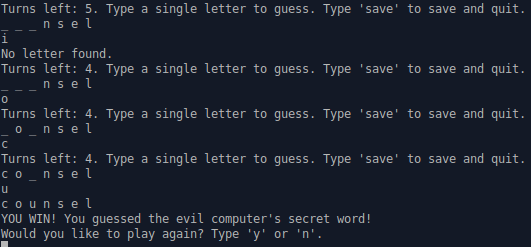

# Hangman

The goal of this project was to create a CLI hangman game that imports 10,000 possible words and has a saving feature.

### Functionality

* Player is able to <strong>save</strong> the game at any point and <strong>load</strong> it from the start screen later
* The game imports 10,000 words from a .txt file
* The computer chooses a random word from the .txt file as the secret word
* Player can guess if a letter is included in the secret word
* Player loses if they take too many guesses

### Screenshot

<strong>Play the live demo [HERE](https://replit.com/@brenttbarness/Hangman-Ruby-CLI-Game?v=1)!</strong>

### Reflections After Completion

Hangman felt like an improvement from my last project. The easiest part was actually building the game. I feel like mastermind was pretty complex. In comparison, hangman isn't all that complicated.

The problem was trying to wrap my head around the saving and loading. The readings don't really show you many ways to save and load things. There is one example, but that example only shows a way to load up a new instance of something that has a bunch of parameters in its initialize method. I think I figured it out. However, I don't know if my loading method is as efficient and as elegant as it could possibly be. I am proud that I figured out how to make it work with both YAML and JSON. The syntax is almost exactly the same.

Object Oriented thinking is making much more sense now. It's not quite second nature, but it's much easier to conceptualize than it was before. However, these projects only need a few objects communicating with each other. I'm sure problems with dependencies will rear their heads once the projects increase in complexity.